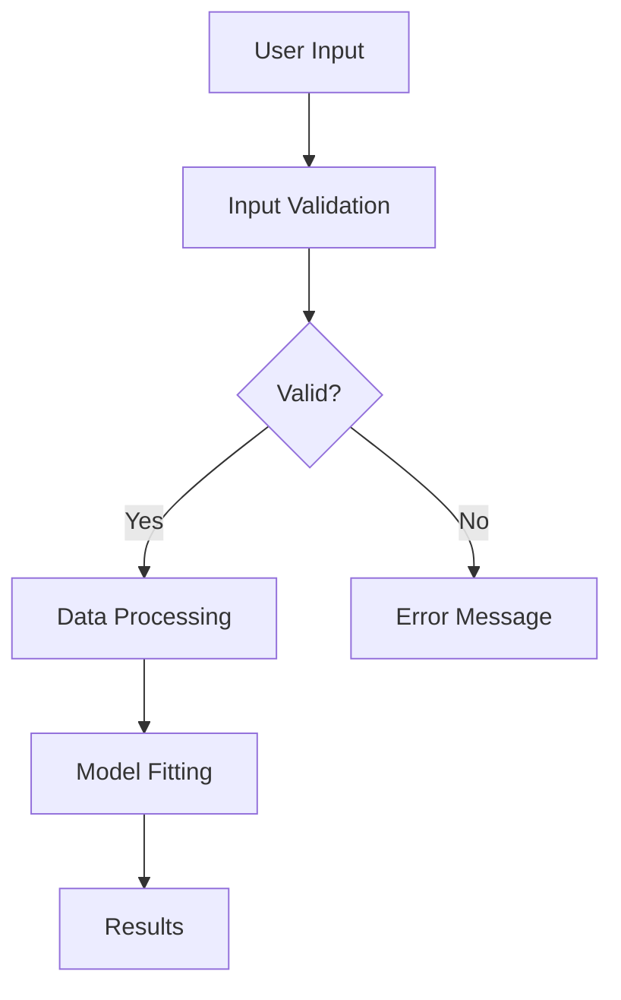

# R Documentation Patterns

## Overview

Best practices and patterns for documenting R code, packages, and projects. Covers README files, code comments, function documentation, and project-level documentation.

## README Documentation

### README Structure

```markdown
# Package Name

<!-- badges: start -->
[](https://github.com/user/pkg/actions/workflows/R-CMD-check.yaml)
[](https://CRAN.R-project.org/package=pkg)
[](https://lifecycle.r-lib.org/articles/stages.html#stable)
[](https://app.codecov.io/gh/user/pkg?branch=main)
<!-- badges: end -->

## Overview

Brief description of what the package does (2-3 sentences).

## Installation

```r
# From CRAN
install.packages("pkg")

# Development version from GitHub
# install.packages("pak")
pak::pak("user/pkg")
```

## Usage

```r
library(pkg)

# Basic example
result <- main_function(data)
```

## Getting Help

- [Package documentation](https://user.github.io/pkg/)
- [Report bugs](https://github.com/user/pkg/issues)

## License

MIT © [Author Name](https://github.com/user)
```

### Badges

```r
# Common badges
usethis::use_badge("CRAN status")
usethis::use_lifecycle_badge("stable")
usethis::use_github_actions_badge("R-CMD-check")
usethis::use_coverage("codecov")
```

## Code Comments

### Comment Guidelines

```r
# Good: Explain WHY, not WHAT
# Normalize by library size to account for sequencing depth differences
normalized_counts <- counts / library_sizes * 1e6

# Bad: Restates the code
# Divide counts by library sizes and multiply by 1e6
normalized_counts <- counts / library_sizes * 1e6
```

### Section Headers

```r
# Data Loading ----
# Load and validate input data

data <- read_csv("input.csv")
validate_data(data)

# Preprocessing ----
# Clean and transform variables

clean_data <- data |>
  remove_missing() |>
  transform_variables()

# Analysis ----
# Fit statistical model

model <- fit_model(clean_data)
```

### TODO Comments

```r
# TODO: Add support for multiple response variables
# FIXME: Handle edge case when n < 10
# NOTE: This assumes data is sorted by date
# HACK: Temporary workaround until upstream fix
```

## Function Documentation Style

### Simple Function

```r
#' Calculate Body Mass Index
#'
#' Computes BMI from weight in kilograms and height in meters.
#'
#' @param weight Numeric vector of weights in kilograms.
#' @param height Numeric vector of heights in meters.
#'
#' @return Numeric vector of BMI values.
#'
#' @examples
#' calculate_bmi(70, 1.75)
#' calculate_bmi(c(70, 80), c(1.75, 1.80))
#'
#' @export
calculate_bmi <- function(weight, height) {
  weight / height^2
}
```

### Complex Function

```r
#' Fit Survival Model with Cross-Validation
#'
#' Fits a Cox proportional hazards model using k-fold cross-validation
#' to assess predictive performance.
#'
#' @param formula A formula specifying the model. The response should be
#'   created using [survival::Surv()].
#' @param data A data frame containing the variables in the formula.
#' @param folds Integer. Number of cross-validation folds. Default is 10.
#' @param stratify Logical. Whether to stratify folds by event status.
#'   Default is `TRUE`.
#' @param seed Integer. Random seed for reproducibility. Default is `NULL`.
#'
#' @return A list with class `cv_surv` containing:
#'   \describe{
#'     \item{model}{The final model fit on all data.}
#'     \item{cv_performance}{Data frame of cross-validation metrics.}
#'     \item{fold_predictions}{Predictions for each fold.}
#'   }
#'
#' @details
#' The function uses [rsample::vfold_cv()] for creating folds and
#' calculates concordance index (C-statistic) for each fold.
#'
#' @section Model Assumptions:
#' The Cox model assumes proportional hazards. Check this assumption
#' using [survival::cox.zph()] on the returned model.
#'
#' @seealso
#' * [survival::coxph()] for fitting Cox models
#' * [survival::Surv()] for creating survival objects
#' * [rsample::vfold_cv()] for cross-validation
#'
#' @examples
#' library(survival)
#'
#' # Fit model with cross-validation
#' result <- cv_survival(
#'   Surv(time, status) ~ age + sex,
#'   data = lung,
#'   folds = 5
#' )
#'
#' # View performance
#' result$cv_performance
#'
#' @export
cv_survival <- function(formula, data, folds = 10, stratify = TRUE, seed = NULL) {
  # Implementation
}
```

## Package Documentation

### DESCRIPTION File

```
Package: pkgname
Title: What the Package Does (One Line, Title Case)
Version: 0.1.0
Authors@R:
    person("First", "Last", , "email@example.com", role = c("aut", "cre"),
           comment = c(ORCID = "YOUR-ORCID-ID"))
Description: What the package does (one paragraph).
    More details about the package can go here across
    multiple lines.
License: MIT + file LICENSE
Encoding: UTF-8
Roxygen: list(markdown = TRUE)
RoxygenNote: 7.2.3
URL: https://github.com/user/pkgname
BugReports: https://github.com/user/pkgname/issues
Depends:
    R (>= 4.1)
Imports:
    dplyr (>= 1.0.0),
    ggplot2
Suggests:
    testthat (>= 3.0.0),
    knitr,
    rmarkdown
VignetteBuilder: knitr
Config/testthat/edition: 3
```

### Package-Level Documentation

```r
#' pkgname: A package for doing something useful
#'
#' The pkgname package provides tools for X, Y, and Z.
#'
#' @section Main functions:
#' * [main_function()] - Does the main thing
#' * [helper_function()] - Helps with stuff
#'
#' @section Getting started:
#' See `vignette("pkgname")` for an introduction.
#'
#' @docType package
#' @name pkgname-package
#' @aliases pkgname
"_PACKAGE"
```

## Vignette Structure

### Basic Vignette

```r
---
title: "Getting Started with pkgname"
output: rmarkdown::html_vignette
vignette: >
  %\VignetteIndexEntry{Getting Started with pkgname}
  %\VignetteEngine{knitr::rmarkdown}
  %\VignetteEncoding{UTF-8}
---

```{r setup, include = FALSE}
knitr::opts_chunk$set(
  collapse = TRUE,
  comment = "#>"
)
library(pkgname)
```

## Introduction

Brief introduction to the package and its purpose.

## Installation

```{r, eval = FALSE}
install.packages("pkgname")
```

## Basic Usage

Walk through a simple example.

```{r}
# Example code
result <- main_function(example_data)
```

## Advanced Features

Cover more complex use cases.

## See Also

- `vignette("advanced-topics")` for more details
- Package website: https://user.github.io/pkgname/
```

## Architecture Documentation

### Mermaid Diagrams

```markdown
## Package Architecture



### Component Descriptions

```markdown
## Component Overview

### Data Layer
- `read_data()` - Import various data formats
- `validate_data()` - Check data integrity
- `transform_data()` - Prepare for analysis

### Analysis Layer
- `fit_model()` - Core model fitting
- `cross_validate()` - Performance assessment
- `tune_params()` - Hyperparameter optimization

### Output Layer
- `summarize_results()` - Generate summaries
- `export_results()` - Save to files
- `visualize_results()` - Create plots
```

## Dataset Documentation

```r
#' Example Patient Data
#'
#' A simulated dataset containing patient information for
#' demonstrating survival analysis methods.
#'
#' @format A data frame with 100 rows and 5 columns:
#' \describe{
#'   \item{patient_id}{Character. Unique patient identifier.}
#'   \item{age}{Numeric. Patient age in years.}
#'   \item{sex}{Factor with levels `"male"` and `"female"`.}
#'   \item{time}{Numeric. Follow-up time in days.}
#'   \item{status}{Integer. Event indicator (1 = event, 0 = censored).}
#' }
#'
#' @source Simulated data for illustration purposes.
#'
#' @examples
#' data(patients)
#' summary(patients)
"patients"
```

## Documentation Workflow

```r
# Generate documentation
devtools::document()

# Check documentation
devtools::check()

# Preview documentation
?function_name

# Build pkgdown site
pkgdown::build_site()
```

## Best Practices

1. **Be concise**: Documentation should be clear and to the point
2. **Use examples**: Include runnable examples for all exported functions
3. **Cross-reference**: Link to related functions and vignettes
4. **Keep updated**: Update docs when code changes
5. **Use markdown**: Enable markdown in roxygen2 for formatting
6. **Document edge cases**: Explain what happens with unusual inputs
7. **Include return values**: Always document what the function returns
